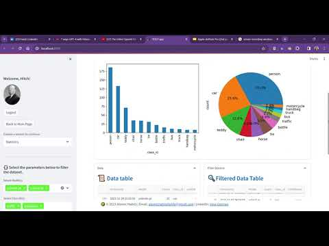

# YOLO models evaluation app using Streamlit

[](https://www.youtube.com/watch?v=l8wvdcJNVAA "Watch Our Demo Video")


🎥 Click on the image above to see a demo video on YouTube.

**Bachelor of Software Engineering**  
_Yoobee College of Creative Innovation, Auckland_

## Introduction

Welcome to the Comparative Object  Detection project!  This project, a capstone for the Bachelor of Software Engineering at Yoobee Colleges of Creative Innovations in Auckland, New Zealand 🥝.


## Features

- **Interactive Web Application**: The application, built using Streamlit, offers a user-friendly interface. Users can easily upload their data, choose from a variety of YOLO models, and get real-time detection results.
  
- **Multiple YOLO Versions**: Users have the flexibility to evaluate pre-trained YOLO models from various versions, including v7 and v8.
  


  
- **Comparison**: Engage in a detailed comparison between YOLOv7 and YOLOv8 models. Analyze their performance across various metrics, observe differences in detection accuracy and processing speed, and determine the optimal model for different use cases.

- **User Authentication & Dashboard**: A built-in authentication system, utilizing **_Google Firebase_** for storage, allows users to securely access the dashboard, view past detection results, and provide feedback.
- **Statistics & Visualization**: Authorized users can access a comprehensive statistics section featuring:

**Visualizations**:
Pie Chart and Bar Graph: Display the most frequently detected objects.
Filtered Dataset Visualization:
Bar Chart of Object Frequencies: Shows the top 10 detected objects.
Line Chart of Detections Over Time: Trends of daily detections.
Confidence Score Distribution: Histogram of confidence scores by class ID.
Heatmap of Detections by Model and Class: Pivot table heatmap showing detections by model and class.
Dataset Access: Users can view the entire dataset of past detections, including models used, objects detected, coordinates of detected objects, and detection dates. The dataset can be filtered by dates, models, and objects, and both the filtered and original datasets can be downloaded as Excel files.


---

### Installation and Setup

### Create a virtual environment
```commandline
# for Windows
# create 
python -m venv myvenv
```

### activate
```commandline
myvenv\Scripts\activate
```


###  **Clone the Repository**:
```commandline
   git clone https://github.com/irinagetman1973/YOLO-Streamlit
   cd YOLO-Streamlit
```

###  **Install Dependencies**:
```commandline
      pip install -r requirements.txt
```


### **Run the Application**:
```commandline
      streamlit run main.py
```


### Download Pre-trained YOLOv8 Detection Weights
Create a directory named `weights` and create a subdirectory named `detection` and save the downloaded YOLOv8 & YOLOv7 object detection weights inside this directory. The weight files can be downloaded from the tables below.


| Model                                                                                | size<br><sup>(pixels) | mAP<sup>val<br>50-95 | Speed<br><sup>CPU ONNX<br>(ms) | Speed<br><sup>A100 TensorRT<br>(ms) | params<br><sup>(M) | FLOPs<br><sup>(B) |
| ------------------------------------------------------------------------------------ | --------------------- | -------------------- | ------------------------------ | ----------------------------------- | ------------------ | ----------------- |
| [YOLOv8n](https://github.com/ultralytics/assets/releases/download/v0.0.0/yolov8n.pt) | 640                   | 37.3                 | 80.4                           | 0.99                                | 3.2                | 8.7               |
| [YOLOv8s](https://github.com/ultralytics/assets/releases/download/v0.0.0/yolov8s.pt) | 640                   | 44.9                 | 128.4                          | 1.20                                | 11.2               | 28.6              |
| [YOLOv8m](https://github.com/ultralytics/assets/releases/download/v0.0.0/yolov8m.pt) | 640                   | 50.2                 | 234.7                          | 1.83                                | 25.9               | 78.9              |
| [YOLOv8l](https://github.com/ultralytics/assets/releases/download/v0.0.0/yolov8l.pt) | 640                   | 52.9                 | 375.2                          | 2.39                                | 43.7               | 165.2             |
| [YOLOv8x](https://github.com/ultralytics/assets/releases/download/v0.0.0/yolov8x.pt) | 640                   | 53.9                 | 479.1                          | 3.53                                | 68.2               | 257.8             |


### Download Pre-trained YOLOv7 Detection Weights


| Model | Test Size | AP<sup>test</sup> | AP<sub>50</sub><sup>test</sup> | AP<sub>75</sub><sup>test</sup> | batch 1 fps | batch 32 average time |
| :-- | :-: | :-: | :-: | :-: | :-: | :-: |
| [**YOLOv7**](https://github.com/WongKinYiu/yolov7/releases/download/v0.1/yolov7.pt) | 640 | **51.4%** | **69.7%** | **55.9%** | 161 *fps* | 2.8 *ms* |
| [**YOLOv7-X**](https://github.com/WongKinYiu/yolov7/releases/download/v0.1/yolov7x.pt) | 640 | **53.1%** | **71.2%** | **57.8%** | 114 *fps* | 4.3 *ms* |
|  |  |  |  |  |  |  |
| [**YOLOv7-W6**](https://github.com/WongKinYiu/yolov7/releases/download/v0.1/yolov7-w6.pt) | 1280 | **54.9%** | **72.6%** | **60.1%** | 84 *fps* | 7.6 *ms* |
| [**YOLOv7-E6**](https://github.com/WongKinYiu/yolov7/releases/download/v0.1/yolov7-e6.pt) | 1280 | **56.0%** | **73.5%** | **61.2%** | 56 *fps* | 12.3 *ms* |


###  Getting Started

To begin exploring the capabilities of the YOLO Models Evaluation App, follow these simple steps:

1. **Installation**: Follow the installation guide above to set up the application on your local machine.

2. **Model Selection**: Choose between YOLOv7 and YOLOv8 models based on your requirements and the nature of your dataset.

3. **Upload Your Data**: Easily upload images or video streams to test the models' detection capabilities.

4. **Analyze Results**: Utilize the data analysis tools to interpret the models' performance and make informed decisions.

5. **We love your feedback**: Join discussions, share feedback, and contribute to the development of the application.

---

### Contributing

We welcome contributions of all kinds - from code improvements and bug fixes to documentation updates. Please feel free to fork the repository, make changes, and submit a pull request. Your contributions will help make this project even better!


---

### License

This project is licensed under the [MIT License](LICENSE.md). Feel free to use, modify, and distribute the code as per the license terms.

---

**Enjoy exploring the world of YOLO models with the YOLO models Comparative  project!**

🥝 Developed with passion by [Irina Getman](https://www.linkedin.com/in/irina-getman-16871b165/).

